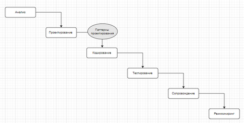

# Паттерны проектирования

## Введение

**Pattern** - узор, шаблон, схема.

**Паттерн проектирования** - схема решения часто встречаемой задачи, прием программирования.

### Решение о применении паттерна

**_Реализация одного и того же паттерна могут сильно отличаться._**

### Классификация

* порождающие (гибкие методы создания объектов)
* структурные (связи между объектами)
* поведенческие (коммуникация между объектами)

**ИЛИ**

* **идиомы** - низкоуровневые (зависят от языка)
* **архитектурные** - самые высокоуровневые

### Повторное использование кода

Реализованные в рамках системы программирования (классы, функции, библиотеки, 
контейнеры (коллекции, итераторы), паттерны программирования, фреймворки (паттерны 
поддерживаемые технологией, библиотекой, инструментарием)).

### Описание паттерна

- описание проблемы
- мотивация к применению
- UML-диаграмма
- структуры применяемых классов
- пример на одном из языков программирования
- особенности реализации
- связь с другими паттернами

### Фундамент паттернов проектирования

ООП. Наследование, инкапсуляция, и полиморфизм можно считать паттернами 
встроенными в систему ООП-проектирования.

## ООП (повторение)

**ООП** - распространение методов системного анализа на процесс
проектирования программного обеспечения.
**ООП** - упростить взаимодействие **бизнес аналитик - проектировщик - разработчик**
**ООП**: парадигмы: абстракция, инкапсуляция, полиморфизм.

